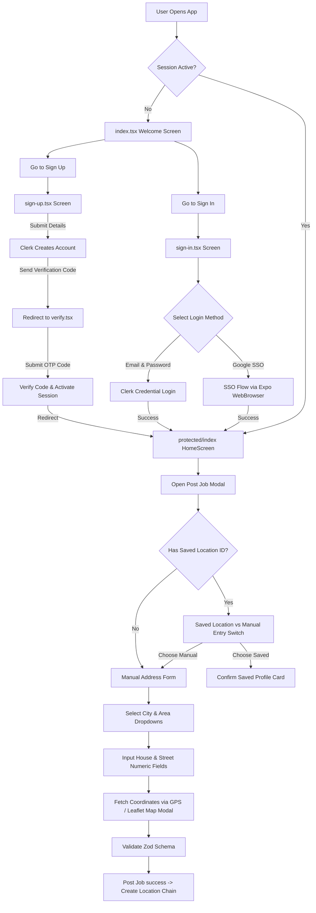

# 🔐 Production-Ready Authentication & Location Flow for Expo & React Native

A premium, secure, and modern authentication workflow template built for **Expo (SDK 54)** and **React Native**. Features an integrated **Clerk Auth** setup for session management, and a robust **Location Resolution System** incorporating saved address profiles, real-time GPS coordinate fetching, and an interactive Leaflet WebView map picker.

---

## 🛠️ Technology Stack & Integrations

Below are the core libraries and tools driving this template:

| Service / Tool | Tech Badges | Purpose |
| :--- | :--- | :--- |
| **Expo SDK 54** |  | Cross-platform framework & dev tools |
| **React Native** |  | Native framework components |
| **Clerk Auth** |  | Identity provider, MFA, session manager, & SSO |
| **TypeScript** |  | Static typing and interface enforcement |
| **React Hook Form** |  | Form state & submission handler |
| **Zod Schema** |  | Type-safe form verification and constraints |
| **Expo Location** |  | Real-time GPS coordinate fetching |
| **Leaflet & WebView** |  | Interactive map picker (zero API keys required) |

---

## 🚀 Key Features

*   **⚡ Clerk Auth Provider Integration:** Session sync across the app using `ClerkProvider` and the native token storage adapter.
*   **🌐 Seamless Google SSO:** Pre-warmed browser sessions using `expo-web-browser` and Clerk's `useSSO` API for secure, fast OAuth.
*   **🔒 Secure Session Storage:** Persistent local storage of user tokens via `expo-secure-store` to keep users logged in.
*   **🚦 Guarded Route Layouts:** File-based navigation structure using `expo-router` split into public/auth `(auth)` and secure `(protected)` router groups.
*   **📝 Strong Form Validation:** Schema-validated input controls with realtime constraint checking, mapping Clerk API errors to specific form fields.
*   **📍 Location Profile Auto-Redirection:** Automatically checks if a user has a saved location profile and offers to pre-fill or post a job with their saved location directly.
*   **🗺️ Interactive Leaflet Map Picker:** OpenStreetMap inside a React Native `WebView`. Supports Nominatim place search, marker dragging, and coordinate confirmation via `postMessage`.
*   **📡 Real-time GPS Locate:** Accesses device GPS using `expo-location` to automatically pre-fill coordinates with maximum accuracy.

---

## 📐 Architecture & Routing Flow

The diagram below outlines the navigation flow, access guards, and location picker states:



---

## 📁 Repository Structure

```
├── .env                        # Development environment credentials (Clerk Publishable Key)
├── app.json                    # Expo config (SDK version, plugins, bundle identifier)
├── package.json                # Project dependencies, libraries, and script actions
└── src/
    ├── app/                    # File-based navigation routes (Expo Router)
    │   ├── (auth)/             # Auth stack (redirects to '/' if session is active)
    │   │   ├── _layout.tsx     # Interceptor & Stack navigation
    │   │   ├── sign-in.tsx     # Sign-in form with Zod schema validation & Google SSO trigger
    │   │   ├── sign-up.tsx     # Sign-up form, Clerk account generation, redirect to verify
    │   │   └── verify.tsx      # Email verification screen for code verification
    │   ├── (protected)/        # Protected stack (redirects to '/sign-in' if session is inactive)
    │   │   ├── _layout.tsx     # Router guard checking session status
    │   │   └── index.tsx       # HomeScreen (Private workspace/dashboard)
    │   ├── _layout.tsx         # Root layout wrapping the app in ClerkProvider with token cache
    │   └── index.tsx           # Entry point / welcome redirection screen
    ├── components/             # Reusable UI Custom Components
    │   ├── CustomButton.tsx    # Styled wrapper for native Pressable element
    │   ├── CustomInput.tsx     # react-hook-form controller input with validation feedback
    │   ├── SignInWith.tsx      # Google SSO authentication handler (incorporates browser pre-warm)
    │   └── home/
    │       └── PostJobModal.tsx # Post Job wizard form with dynamic location resolution, GPS & maps
    │   ├── provider/           # Directory designated for global providers
    │   │   ├── auth.tsx        # Auth provider holding session and user details
    │   │   └── post-job.tsx    # Post Job workflow logic with location chain checks
```

---

## 📝 Code Components Walkthrough

### 🔒 Core Layout & Guards

1.  **Root Layout (`src/app/_layout.tsx`):** Wraps the entire application with the Clerk authentication context. It initiates the session manager with a secure token cache that writes directly to the native `SecureStore` instead of memory.
2.  **Protected Route Guard (`src/app/(protected)/_layout.tsx`):** Assures that any view nested under `(protected)` cannot be mounted unless the user is signed in. If the session expires or is missing, it immediately redirects them to `/sign-in`.

### 📍 Interactive Location Flow

1.  **Conditional Schema Validation (`PostJobModal.tsx`):** We use Zod's `superRefine` to conditionally require address details only if the user chooses the manual entry route:
    ```typescript
    const postJobSchema = z.object({
      useSavedLocation: z.boolean(),
      city: z.string().optional(),
      area: z.string().optional(),
      houseNumber: z.string().optional(),
      streetNumber: z.string().optional(),
      zipCode: z.string().optional(),
      pinLocation: z.string().optional(),
      // ...
    }).superRefine((val, ctx) => {
      if (!val.useSavedLocation) {
        if (!val.houseNumber || !/^\d+$/.test(val.houseNumber.trim())) {
          ctx.addIssue({ code: 'custom', message: 'Numeric house number is required', path: ['houseNumber'] });
        }
        // Validate zipCode, city, area, street, pinLocation...
      }
    });
    ```
2.  **Webview PostMessage Bridge:** The embedded Leaflet page returns selected coordinates instantly back to the React Native form state:
    ```typescript
    // WebView (HTML JavaScript)
    window.ReactNativeWebView.postMessage(JSON.stringify({
      type: 'LOCATION_SELECTED',
      lat: selectedCoords.lat,
      lng: selectedCoords.lng
    }));
    
    // React Native Handler
    const handleMapMessage = (event: any) => {
      const data = JSON.parse(event.nativeEvent.data);
      if (data.type === 'LOCATION_SELECTED') {
        setValue('pinLocation', `${data.lat.toFixed(6)}, ${data.lng.toFixed(6)}`, { shouldValidate: true });
        setShowMapPicker(false);
      }
    };
    ```

---

## 🛠️ Step-by-Step Setup

Follow these steps to run the authentication & location flow locally:

### 1. Prerequisite Setup

*   Create a free account at [Clerk](https://clerk.com).
*   Create a new application in your Clerk Dashboard and enable the **Email / Password** and **Google SSO** sign-in providers.
*   Copy your **Publishable Key**.

### 2. Clone & Install Dependencies

Open your terminal and run:

```bash
# Install packages using npm
npm install
```

### 3. Environment Variables Configuration

Create a `.env` file in the root directory (already populated locally) and declare your Clerk Publishable Key:

```env
EXPO_PUBLIC_CLERK_PUBLISHABLE_KEY=your_clerk_publishable_key_here
EXPO_PUBLIC_API_URL=your_backend_api_url_here
```

### 4. Run the Dev Server

Launch the Expo development server:

```bash
# Start expo dev server
npx expo start
```

From here, you can:
*   Press **`a`** to open on an Android emulator or device.
*   Press **`i`** to open on an iOS simulator.
*   Press **`w`** to open on web.
*   Scan the QR code in the terminal using the **Expo Go** application on your physical device.

---

## 🧑‍💻 Technical Notes

*   **OAuth Scheme Configuration:** When deploying to production standalone apps, configure the native redirection URL scheme (defined under `expo.scheme` in `app.json`) within your Clerk Dashboard under **Social Connections** ➡️ **Google**.
*   **Saved Locations Resolver:** The location creation pipeline automatically handles lookup/creation of countries, cities, and areas in cascading order (`getOrCreateLocationChain`), resolving database IDs and returning a unified `locationId` used to link jobs.
