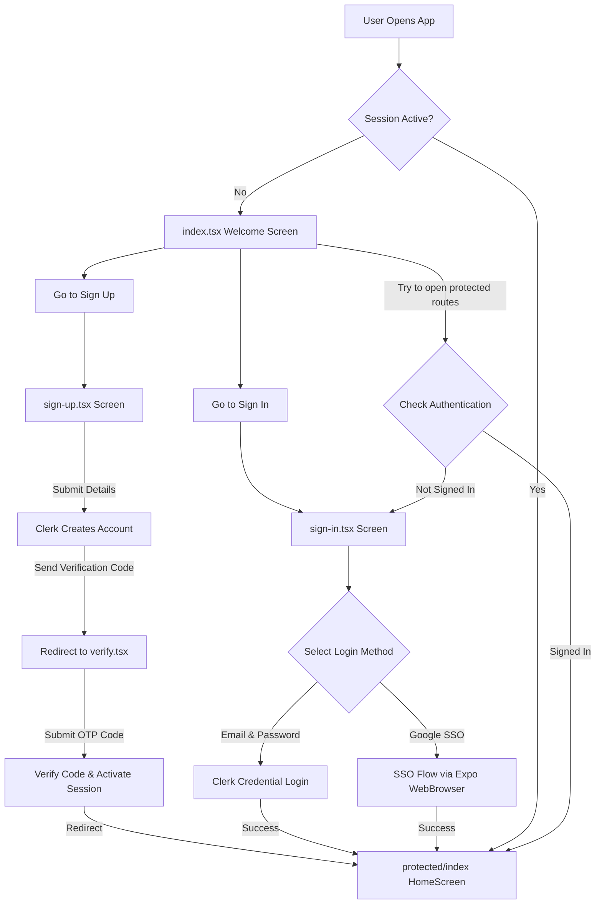

# 🔐 Production-Ready Authentication Flow for Expo & React Native

A premium, secure, and modern authentication workflow template built for **Expo (SDK 54)** and **React Native**. Integrated with **Clerk Auth** for state-of-the-art session management, standard credentials login, and Single Sign-On (SSO).

---

## 🛠️ Technology Stack & Integrations

Below are the core libraries and tools driving this secure authentication flow:

| Service / Tool | Tech Badges | Purpose |
| :--- | :--- | :--- |
| **Expo SDK 54** |  | Cross-platform framework & dev tools |
| **React Native** |  | Native framework components |
| **Clerk Auth** |  | Identity provider, MFA, session manager, & SSO |
| **TypeScript** |  | Static typing and interface enforcement |
| **React Hook Form** |  | Lightweight form state & submission handler |
| **Zod Schema** |  | Type-safe form verification and constraints |

---

## 🚀 Key Features

*   **⚡ Clerk Auth Provider Integration:** Session sync across the app using `ClerkProvider` and the native token storage adapter.
*   **🌐 Seamless Google SSO:** Pre-warmed browser sessions using `expo-web-browser` and Clerk's `useSSO` API for secure, fast OAuth.
*   **🔒 Secure Session Storage:** Persistent local storage of user tokens via `expo-secure-store` to keep users logged in.
*   **🚦 Guarded Route Layouts:** File-based navigation structure using `expo-router` split into public/auth `(auth)` and secure `(protected)` router groups.
*   **📝 Strong Form Validation:** Schema-validated input controls with realtime constraint checking, mapping Clerk API errors to specific form fields.

---

## 📐 Architecture & Routing Flow

The diagram below outlines the navigation flow and access guards implemented in the app:



---

## 📁 Repository Structure

```
├── .env                        # Development environment credentials (Clerk Publishable Key)
├── app.json                    # Expo config (SDK version, plugins, bundle identifier)
├── package.json                # Project dependencies, libraries, and script actions
└── src/
    ├── app/                    # File-based navigation routes (Expo Router)
    │   ├── (auth)/             # Auth stack (redirects to '/' if session is active)
    │   │   ├── _layout.tsx     # Interceptor & Stack navigation
    │   │   ├── sign-in.tsx     # Sign-in form with Zod schema validation & Google SSO trigger
    │   │   ├── sign-up.tsx     # Sign-up form, Clerk account generation, redirect to verify
    │   │   └── verify.tsx      # Email verification screen for code verification
    │   ├── (protected)/        # Protected stack (redirects to '/sign-in' if session is inactive)
    │   │   ├── _layout.tsx     # Router guard checking session status
    │   │   └── index.tsx       # HomeScreen (Private workspace/dashboard)
    │   ├── _layout.tsx         # Root layout wrapping the app in ClerkProvider with token cache
    │   └── index.tsx           # Entry point / welcome redirection screen
    ├── components/             # Reusable UI Custom Components
    │   ├── CustomButton.tsx    # Styled wrapper for native Pressable element
    │   ├── CustomInput.tsx     # react-hook-form controller input with validation feedback
    │   └── SignInWith.tsx      # Google SSO authentication handler (incorporates browser pre-warm)
    └── provider/               # Directory designated for global providers
```

---

## 📝 Code Components Walkthrough

### 🔒 Core Layout & Guards

1.  **Root Layout (`src/app/_layout.tsx`):** Wraps the entire application with the Clerk authentication context. It initiates the session manager with a secure token cache that writes directly to the native `SecureStore` instead of memory:
    ```tsx
    import { ClerkProvider } from '@clerk/clerk-expo';
    import { tokenCache } from '@clerk/clerk-expo/token-cache';
    
    // ...
    <ClerkProvider publishableKey={publishableKey} tokenCache={tokenCache}>
        <Slot />
    </ClerkProvider>
    ```
2.  **Protected Route Guard (`src/app/(protected)/_layout.tsx`):** Assures that any view nested under `(protected)` cannot be mounted unless the user is signed in. If the session expires or is missing, it immediately redirects them to `/sign-in`:
    ```tsx
    const { isSignedIn } = useAuth();
    if (!isSignedIn) {
        return <Redirect href='/sign-in' />;
    }
    ```
3.  **Auth Route Guard (`src/app/(auth)/_layout.tsx`):** Prevents logged-in users from seeing the Sign In, Sign Up, or Verification screens. It immediately pushes them back to `/` to avoid redundant workflows.

### 🧬 Reusable Components

*   **`CustomInput.tsx`:** Links a standard native `TextInput` directly to a `react-hook-form` validation context. Dynamically changes border colors to `crimson` upon error and prints schema errors cleanly beneath the input.
*   **`SignInWith.tsx`:** Coordinates Google SSO via Web Browser. Uses a pre-warming hook to load WebBrowser resources in the background on Android, providing smooth, high-fidelity browser transitions.

---

## 🛠️ Step-by-Step Setup

Follow these steps to run the authentication flow template locally:

### 1. Prerequisite Setup

*   Create a free account at [Clerk](https://clerk.com).
*   Create a new application in your Clerk Dashboard and enable the **Email / Password** and **Google SSO** sign-in providers.
*   Copy your **Publishable Key**.

### 2. Clone & Install Dependencies

Open your terminal and run:

```bash
# Install packages using npm
npm install
```

### 3. Environment Variables Configuration

Create a `.env` file in the root directory (already populated locally) and declare your Clerk Publishable Key:

```env
EXPO_PUBLIC_CLERK_PUBLISHABLE_KEY=your_clerk_publishable_key_here
```

> [!IMPORTANT]
> The publishable key must be prefixed with `EXPO_PUBLIC_` to be exposed to your application bundle during building/runtime.

### 4. Run the Dev Server

Launch the Expo development server:

```bash
# Start expo dev server
npx expo start
```

From here, you can:
*   Press **`a`** to open on an Android emulator or device.
*   Press **`i`** to open on an iOS simulator.
*   Press **`w`** to open on web.
*   Scan the QR code in the terminal using the **Expo Go** application on your physical device.

---

## 🧑‍💻 Technical Notes

*   **OAuth Scheme Configuration:** When deploying to production standalone apps, configure the native redirection URL scheme (defined under `expo.scheme` in `app.json`) within your Clerk Dashboard under **User & Authentication** ➡️ **Social Connections** ➡️ **Google**.
*   **Error Parser Utility:** Native forms parse Clerk's API errors using a helper switch (`mapClerkErrorToFormField`) to map specific server-side constraints (e.g. invalid password, already registered email) into native form controller errors dynamically.
