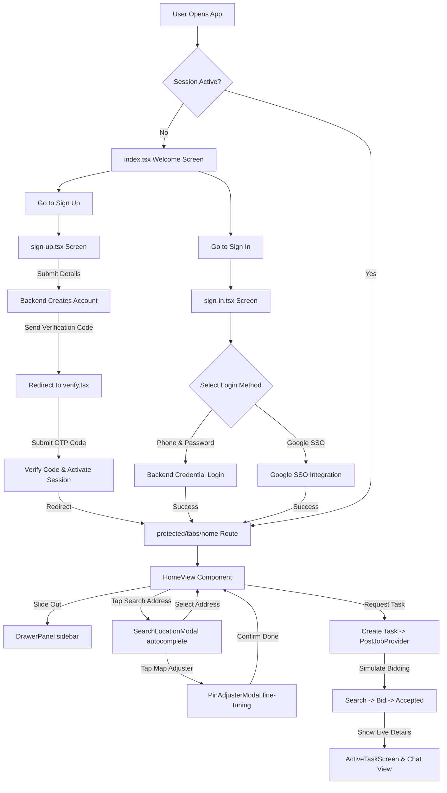

# 🔐 Production-Ready Authentication, Task Simulation & Mapping Flow (Expo & React Native)

A premium, secure, and modern task-booking workflow built for **Expo (SDK 54)** and **React Native**. Features a custom session system utilizing local encrypted storage, modular production-grade UI design, an interactive Leaflet mapping engine, and a real-time provider/client bidding and chat simulator.

---

## 🛠️ Technology Stack & Integrations

Below are the core libraries and tools driving this project:

| Service / Tool | Tech Badges | Purpose |
| :--- | :--- | :--- |
| **Expo SDK 54** |  | Cross-platform framework & developer tools |
| **React Native** |  | Native framework components |
| **Expo Secure Store** |  | Encrypted storage for session persistence |
| **React Native WebView** |  | Sandboxed engine for embedded Leaflet mapping |
| **Leaflet & OSM** |  | Interactive maps with visual pin offset (zero API keys needed) |
| **Nominatim Search** |  | Real-time OpenStreetMap address suggestions API |
| **React Hook Form & Zod** |  | Schema-validated fields & dynamic error constraints |
| **React Query** |  | Server state management and mutation lifecycle hooks |

---

## 🚀 Key Features

*   **🔒 Encrypted Session Syncing:** Encapsulated credentials persistence utilizing `expo-secure-store` with centralized session indicators logged in development.
*   **🗺️ Precision Leaflet Alignment:** A pixel-projected alignment algorithm. It offsets map centers to match the visual center marker located at `35%` screen height (so it sits perfectly above the collapsible bottom sheet) with a single transition step to prevent double-move conflicts.
*   **🔍 OpenStreetMap Nominatim Auto-Suggest:** Real-time input matching for addresses, pre-filling search inputs with currently active location labels to enable quick suggestions.
*   **⏱️ Active Task Simulation Engine:** State-machine driver bidding loops:
    1. Triggers scanning radar upon booking.
    2. Spawns mock professional bids after 5 seconds.
    3. Handles real-time navigation map updates, professional profiles, and call routing.
*   **💬 Responsive Professional Chatbot:** Chat interface with mock professional responses responding instantly (1.5-second reply cycles) with randomized, contextual driver messages.
*   **⭐️ Slide-Out Navigation Drawer:** Premium sidebar overlay incorporating customer stars rating indicators, verified checkmarks, active request shortcuts, and history toggles.

---

## 📐 Architecture & Routing Flow



---

## 📁 Repository Structure

```
├── api/                        # REST API clients (Axios/Fetch endpoints)
│   ├── area.ts                 # Cascading Area resolution endpoints
│   ├── city.ts                 # City query client hooks
│   ├── location.ts             # cascade locations creator (getOrCreateLocationChain)
│   └── user.ts                 # Login & Registration authentication endpoints
├── src/
│   ├── app/                    # File-Based Navigation (Expo Router)
│   │   ├── (auth)/             # Public login/signup routes
│   │   │   ├── sign-in.tsx     # Zod validated credentials login & Google SSO
│   │   │   ├── sign-up.tsx     # Account registration flow
│   │   │   └── verify.tsx      # Email verification input view
│   │   ├── (protected)/        # Session-guarded private route group
│   │   │   ├── (tabs)/         # Bottom tabs navigator stack
│   │   │   │   ├── _layout.tsx # Tabs layouts styling (home/profile tabs)
│   │   │   │   ├── home.tsx    # Mounts HomeView dashboard
│   │   │   │   └── profile.tsx # Mounts ProfileView settings
│   │   │   ├── _layout.tsx     # Auth validation session guard
│   │   │   └── profile-setup.tsx # Cascade profile creation flow
│   │   ├── _layout.tsx         # App wrapper mapping AuthProvider
│   │   └── index.tsx           # Initial session router redirector
│   ├── components/             # Reusable UI Controls
│   │   ├── CustomButton.tsx    # Premium pressable button component
│   │   ├── CustomInput.tsx     # Typed validation field inputs
│   │   ├── SignInWith.tsx      # SSO layout pre-wire
│   │   └── home/               # Modularized Dashboard Components
│   │       ├── DrawerPanel.tsx        # Slide-out navigation list & ratings
│   │       ├── HomeView.tsx           # Core Leaflet map dashboard
│   │       ├── PinAdjusterModal.tsx   # Fine-tune Leaflet WebView overlay
│   │       ├── ProfileView.tsx        # Profile settings item listing
│   │       ├── SearchLocationModal.tsx # Nominatim OS Address autocomplete
│   │       └── TaskHistoryModal.tsx   # Request logs tables
│   ├── provider/               # React Context Providers
│   │   ├── auth.tsx            # Global SecureStore session mapping
│   │   └── post-job.tsx        # Task simulation state machine & chat
```

---

## 📝 Code Architectures & Mechanics

### 1. Leaflet Coordinate-Offset Alignment
To position target coordinates directly under a marker pin visual offset at `35%` of screen height, the code projects the coordinate to pixels at zoom 17, applies the offset difference, and unprojects it back to coordinates. This performs the alignment in a single `setView` transaction, preventing overlapping animation race conditions:

```typescript
const targetLatLng = L.latLng(coords.latitude, coords.longitude);
const targetPoint = map.project(targetLatLng, 17);
const size = map.getSize();
// Offset calculation from center (50%) to visual target (35%)
const offset = L.point(0, size.y * (0.5 - 0.35));
const centerPoint = targetPoint.add(offset);
const centerLatLng = map.unproject(centerPoint, 17);

// Single view alignment
map.setView(centerLatLng, 17);
```

### 2. Provider Task Simulation Lifecycle
The `PostJobProvider` acts as a local dispatch server, simulating search, bid discovery, professional acceptance, and coordinate-matching loops:

*   **Searching Stage:** Emits radar sweeps for 5 seconds.
*   **Bidding Stage:** Spawns provider offers (mock prices) with animated buttons.
*   **Active Booking:** Triggers full-screen professional profile sheets showing contact cards and ratings.
*   **Chat Simulator:** Automatically processes client messages and fires back randomized responses after 1.5 seconds:

```typescript
const triggerProfessionalResponse = (userMsg: string) => {
  setTimeout(() => {
    const replies = [
      "Understood, I am on my way.",
      "Perfect. I am driving right now, will arrive soon.",
      "I have arrived at the location, see you shortly."
    ];
    const replyMsg: ChatMessage = {
      id: Date.now().toString(),
      text: replies[Math.floor(Math.random() * replies.length)],
      sender: 'professional',
      time: new Date().toLocaleTimeString([], { hour: '2-digit', minute: '2-digit' }),
    };
    setActiveChatMessages((prev) => [...prev, replyMsg]);
  }, 1500);
};
```

---

## 🚀 Running Locally

### 1. Install Dependencies
```bash
npm install
```

### 2. Environment Variables Configuration
Create a `.env` file in the root directory:
```env
EXPO_PUBLIC_API_URL=your_backend_api_url_here
```

### 3. Run the Development Server
```bash
npx expo start
```
*   Press **`a`** to open on Android.
*   Press **`i`** to open on iOS.
*   Press **`r`** to reload the bundle cache.
