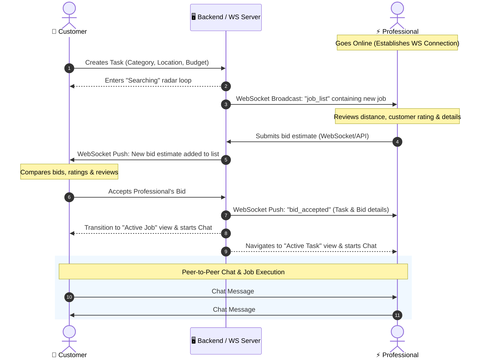

# 🔐 Production-Ready Authentication, Admin Panel, Task Hiring & Mapping Flow (Expo & React Native)

<table align="center">
<tr>
<td align="center">

### 🎥 Kaam Karwao Demo

<video
  src="https://github.com/user-attachments/assets/ae363c29-7017-44c1-b0b6-7505cb8d7bcd"
  width="400"
  controls>
</video>

</td>
</tr>
</table>

A premium, secure, and modern hiring services & administration application built for **Expo (SDK 54)** and **React Native**. Features a custom session system utilizing local encrypted storage, modular production-grade architecture, a full 17-module Admin Control Panel, an instant-mount Leaflet mapping engine, persistent MMKV caching, progressive auth state transitions, and real-time provider/client bidding and chat integration.

---

## 🛠️ Technology Stack & Integrations

Below are the core libraries and tools driving this project:

| Service / Tool | Tech Badges | Purpose |
| :--- | :--- | :--- |
| **Expo SDK 54** |  | Cross-platform framework & developer tools |
| **React Native** |  | Native framework components |
| **TanStack Query** |  | Server state management, caching, and admin dashboard hooks |
| **MMKV Storage** |  | Ultra-fast synchronous key-value storage for location & task history persistence |
| **Expo Secure Store** |  | Encrypted storage for JWT session persistence |
| **React Native WebView** |  | Sandboxed engine for embedded Leaflet mapping |
| **Leaflet & OSM** |  | Interactive maps with visual pin offset (zero API keys needed) |
| **Nominatim Search** |  | Real-time OpenStreetMap address suggestions API |
| **Zustand** |  | Lightweight global state management for categories & tasks |

---

## 🚀 Key Production Features

*   **👑 Full 17-Module Admin Control Panel:** Complete production admin system supporting User Directories, Verification Toggles, Task Management, Bidding Analysis, Reviews & Ratings, Worker Earnings, Attachments Gallery, and Master Data CRUD (Categories, Countries, Cities, Areas, Locations, User Types, Payment Preferences, Statuses, Configs).
*   **🔄 Progressive Step Auth Loading:** Sign In and Sign Up buttons feature real-time step-by-step progress state indicators (*"Authenticating credentials..."*, *"Fetching user profile..."*, *"Syncing session..."*, *"Redirecting..."*) with inline activity spinners.
*   **🗺️ Instant-Mount Leaflet Map:** Zero-delay map mounting decoupled from data loading. Automatically initializes from MMKV local storage and smoothly animates camera position (`map.panTo`) when location updates resolve.
*   **⚡ Smart Single Retry Engine:** Automated failure detection for missing categories or payment preferences. Displays a unified, single retry card in the home bottom sheet that selectively re-fetches only the specific missing API data.
*   **🔒 Encrypted Session Syncing:** Encapsulated credentials persistence utilizing `expo-secure-store` with centralized session indicators logged in development.
*   **⏱️ Real-Time Task Bidding & Dispatch:** State-machine dispatcher matching loops:
    1. Triggers scanning radar upon booking to broadcast request to nearby service providers.
    2. Spawns professional bids and manages provider cost estimations.
    3. Handles real-time navigation map updates, professional profiles, and call routing.
*   **💬 Responsive Chat Engine:** Integrated provider-to-client messaging system, supporting active conversations, instructions sharing, and scheduling.
*   **⭐️ Slide-Out Navigation Drawer:** Premium sidebar overlay incorporating customer stars rating indicators, background-prefetched review counts, verified checkmarks, and task history toggles.

---

## 👥 Ecosystem: Customers, Professionals & Admin

KaamKarwao is built as a complete multi-role platform with custom user experiences tailored specifically for:

1. **Customers (Clients)** — Seeking on-demand specialized home & technical services.
2. **Professionals (Service Providers)** — Offering expertise, receiving bids, and managing daily earnings.
3. **Administrators** — Complete oversight, verification control, master data management, and system analytics.

---

### 👤 1. Customers (Clients)

The customer app experience centers around simplicity, precision, and speed.

#### 🌟 Features & Interface
*   **Instant Map & MMKV Location Persistence:** Zero-delay Leaflet map mount powered by MMKV device storage with Nominatim search integration.
*   **Task Request Dispatch:** Multi-step hiring radar broadcasting service requests to nearby service providers in real-time.
*   **Bid Comparison Dashboard:** Displays incoming bids with provider profiles, verification badges, ratings, and estimates.
*   **Smart Single Retry:** Unified error handler banner that detects missing API dependencies and re-fetches only failed items with one tap.

---

### ⚡ 2. Professionals (Service Providers)

Acts as a mobile command center for job discovery, bidding, and financial tracking.

#### 🌟 Features & Interface
*   **Pro Dashboard Command Center:** Displays weekly earnings report (via custom bar charts), active stats (weekly earnings, total earnings, completed jobs count, ratings), and quick access to live job listings.
*   **Online/Offline Toggle:** Status pill establishing persistent WebSocket connections to receive incoming job requests in real-time.
*   **WebSocket Live-Job Feed:** Real-time updates displaying newly requested local jobs in proximity.
*   **Bidding Bottom Sheet:** Responsive interaction interface allowing professionals to submit custom estimates.

---

### 👑 3. Administrator Control Panel

A production-grade, modular administration suite covering 17 system domains under strict `< 500 lines` per file architecture:

| Admin Module | Location | Core Functionality |
| :--- | :--- | :--- |
| **Dashboard** | `AdminDashboardView.tsx` | High-level KPI aggregations (Total Tasks, Open Bids, Active Users, Total Ratings) via TanStack Query. |
| **User Directory** | `AdminUsersView.tsx` | Comprehensive user table with search, role filters, and profile details modal. |
| **Pro Details** | `AdminProDetailView.tsx` | Verification status toggle, earnings inspection, assigned tasks, and reviews breakdown per provider. |
| **Task Operations** | `AdminTasksView.tsx` | Filterable list of all platform tasks with detailed task inspection modals and deletion dialogs. |
| **Bidding Breakdown** | `AdminBidsView.tsx` | Live bid inspection per task with estimate breakdowns. |
| **Reviews & Ratings** | `AdminReviewsView.tsx` | Moderate, search, inspect, and delete platform reviews. |
| **Worker Earnings** | `AdminEarningsView.tsx` | Track and manage financial earnings records for service providers. |
| **Attachment Gallery** | `AdminAttachmentsView.tsx` | Inspect media attachments uploaded across task requests. |
| **Master Data Manager** | `AdminMasterDataView.tsx` | Full CRUD suite for 9 core tables: Categories, Countries, Cities, Areas, Locations, User Types, Payment Prefs, Statuses, Configs. |

---

## 🔄 Real-Time Bid & Dispatch Interaction Model



---

## 📁 Repository Structure

```
├── src/
│   ├── app/                    # File-Based Navigation (Expo Router)
│   │   ├── (auth)/             # Progressive login & registration screens
│   │   ├── (protected)/        # Auth-guarded tabs & profile setup
│   ├── components/             # Reusable UI Controls
│   │   ├── admin/              # Modular Admin components (StatCard, ConfirmDialog, etc.)
│   │   ├── client/             # HomeMapView, HomeBottomSheet, DrawerPanel, SearchLocationModal
│   ├── hooks/                  # Custom React Hooks
│   │   ├── admin/              # useAdminDashboard TanStack Query hook
│   │   └── useHomeViewLocation.ts # Location & Leaflet geocoding state
│   ├── pages/                  # Full Screen Views
│   │   ├── admin/              # 10 Dedicated Admin Module Screens
│   │   ├── client/             # HomeView, ActiveTaskScreen
│   ├── services/               # Clean API Service Layer (Modular .ts files)
│   │   ├── adminUsers.ts       # User profiles & verification API
│   │   ├── adminTasks.ts       # Admin tasks CRUD API
│   │   ├── adminReviews.ts     # Reviews & ratings API
│   │   ├── adminEarnings.ts    # Worker earnings CRUD API
│   │   ├── attachment.ts       # Media attachments API
│   │   ├── bidding.ts          # Bidding breakdown API
│   │   ├── masterData.ts       # Master lookup tables facade
│   │   └── fetchClient.ts      # Auth header injector fetch client
│   ├── store/                  # Global State Stores
│   │   ├── categoryStore.ts    # Zustand category store
│   │   └── taskStore.ts        # MMKV persisted task store
│   ├── types/                  # TypeScript Interfaces
│   │   ├── admin.ts            # Admin domain data models
│   │   └── index.ts            # App domain models
│   └── utils/                  # Utility Helpers
│       └── locationCache.ts    # MMKV synchronous location cache
```

---

## 🚀 Running Locally

### 1. Install Dependencies
```bash
npm install
```

### 2. Environment Variables Configuration
Create a `.env` file in the root directory:
```env
EXPO_PUBLIC_API_URL=your_backend_api_url_here
```

### 3. Run the Development Server
```bash
npx expo start
```
*   Press **`a`** to open on Android.
*   Press **`i`** to open on iOS.
*   Press **`r`** to reload the bundle cache.
